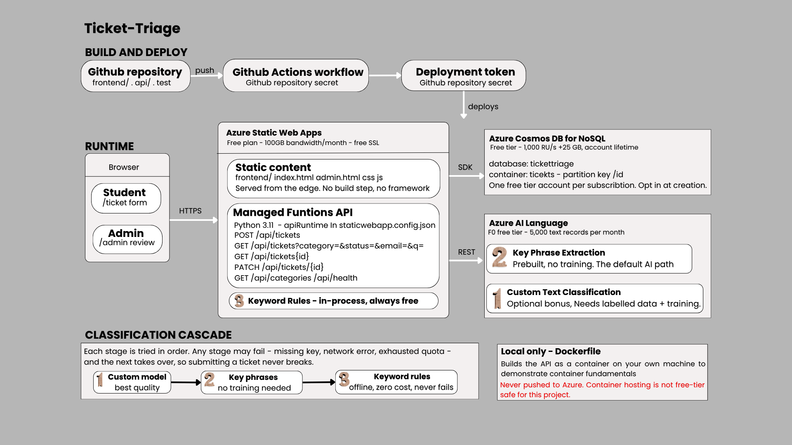

# TicketTriage

A free-tier AI helpdesk assistant for the AI-200 capstone. Students and staff
submit support tickets, the system suggests a category, and an admin reviews
tickets and moves them through a status workflow.

Everything runs on Azure free-tier services: **Static Web Apps (Free plan)**,
**Azure Functions managed API (Python 3.11)**, **Cosmos DB for NoSQL (free
tier)** and **Azure AI Language (F0)**.



---

## Contents

- [Quick start](#quick-start)
- [Project layout](#project-layout)
- [How classification works](#how-classification-works)
- [Environment variables](#environment-variables)
- [Azure setup](#azure-setup)
- [Deployment](#deployment)
- [Testing](#testing)
- [Docker](#docker)
- [Cost safety](#cost-safety)
- [Limitations](#limitations)
- [Future improvements](#future-improvements)

---

## Quick start

You do **not** need an Azure account to run the app. With no configuration it
uses an in-memory store and offline keyword classification.

```bash
git clone <your-repo-url> tickettriage
cd tickettriage

python -m venv .venv
source .venv/bin/activate          # Windows: .venv\Scripts\activate
pip install -r requirements-dev.txt

python scripts/dev_server.py
```

Open <http://localhost:4280> for the ticket form and
<http://localhost:4280/admin> for the admin view.

Load the 18 sample tickets and check how the classifier did:

```bash
python scripts/seed_api.py
```

```
  ok    Cannot access campus Wi-Fi          expected=IT Support   got=IT Support   (keyword-rules, 0.97)
  ...
Agreement with human labels: 18/18 = 100%
```

### Running with the real Azure tooling

`scripts/dev_server.py` is a convenience shim. Before you deploy, run the app
at least once on the actual runtime so you catch routing and runtime issues:

```bash
npm install -g @azure/static-web-apps-cli azure-functions-core-tools@4
cp api/local.settings.json.sample api/local.settings.json   # then fill in values
swa start frontend --api-location api
```

---

## Project layout

```
tickettriage/
├── frontend/                  Static site. No build step, no framework.
│   ├── index.html             Ticket submission form
│   ├── admin.html             Admin review, filters, status updates
│   ├── staticwebapp.config.json   Runtime version, routes, headers
│   ├── css/styles.css
│   └── js/  api.js  submit.js  admin.js
├── api/                       Azure Functions, Python v1 programming model
│   ├── tickets/               GET list + POST create
│   ├── ticket_item/           GET one + PATCH status/category
│   ├── categories/            Reference lists for the UI
│   ├── health/                Diagnostics and free-tier evidence
│   ├── shared/                Code shared by all functions
│   │   ├── categories.py      Category ontology and keyword scoring
│   │   ├── classifier.py      Three-stage classification cascade
│   │   ├── config.py          Settings from app settings / env vars
│   │   ├── models.py          Validation, ticket assembly, status changes
│   │   ├── repository.py      Cosmos DB + in-memory storage
│   │   └── http.py            JSON responses and the admin guard
│   ├── host.json
│   ├── requirements.txt
│   └── local.settings.json.sample
├── tests/                     91 pytest tests
├── data/
│   ├── seed_tickets.json      18 labelled sample tickets
│   └── ctc/generate_corpus.py Builds a Custom Text Classification corpus
├── scripts/
│   ├── dev_server.py          Run everything with only Python
│   └── seed_api.py            Load sample data, measure agreement
├── docs/architecture.svg|png
├── Dockerfile                 Local container evidence only
└── .github/workflows/         Test then deploy
```

---

## How classification works

Three stages, tried in order. The first that produces a usable answer wins; any
stage can fail without breaking ticket submission.

| # | Stage | How it works |
|---|-------|---------|
| 1 | `azure-ai-language-custom` | Uses a trained Azure Custom Text Classification model to predict the most suitable catgeory |
| 2 | `azure-ai-language-keyphrase` | Extracts meaningful phrases from the ticket and uses them as additional evidence for category matching |
| 3 | `keyword-rules` | Evaluates the ticket using predefined phrases and weighted keywords |

Stage 1 is used when the custom model has been configured and trained. Its prediction is only accepted when the returned confidence score meets the required threshold. A low-confidence prediction is rejected, allowing the ticket to continue to the next classification stage.

Stage 2 is Key Phrase Analysis. When the custom model cannot provide an acceptable result, Azure AI language can analyse the ticket and identify its most meaningful phrases.

For example, a ticket mentioning `tuition fee` and `outstanding balance` provides strong evidence for Student Finance, while phrases such as `library book` and `overdue` indicate Library Services.

The extracted phrases are combined with the ticket text when determining which category has the strongest match.

Stage 3 scores four weighted buckets of terms:

| Bucket | Weight | Example |
|--------|--------|---------|
| phrase | 4 | `student loan`, `campus wifi` |
| strong | 3 | `tuition`, `librarian` |
| medium | 2 | `invoice`, `classroom` |
| weak | 1 | `pay`, `broken` |

Ambiguous words are handled deliberately. `loan` appears in both Student
Finance and Library Services, and `fine` in both too. The disambiguating
multi-word forms (`student loan`, `book loan`, `library fine`, `late fee`) sit
in the weight-4 phrase bucket, so they outvote the bare term.

Confidence is `0.40 + 0.35 x saturation + 0.25 x margin`, where *saturation* is
how much total evidence the winner gathered and *margin* is how decisively it
beat the runner-up. A ticket with no matches at all returns General Enquiry at
0.30.

Every ticket records `classificationMethod`, `classificationConfidence` and
`classificationEvidence`, so the admin view shows exactly why a ticket landed
where it did. That makes a strong demo.

---

## Environment variables

Set these as **Application settings** on the Static Web App (Settings →
Environment variables), or in `api/local.settings.json` when running locally.
None are required to run the app.

| Setting | Required | Default | Purpose |
|---------|----------|---------|---------|
| `COSMOS_ENDPOINT` | for persistence | – | `https://<account>.documents.azure.com:443/` |
| `COSMOS_KEY` | for persistence | – | Primary key |
| `COSMOS_DATABASE` | no | `tickettriage` | Database name |
| `COSMOS_CONTAINER` | no | `tickets` | Container name |
| `LANGUAGE_ENDPOINT` | for AI | – | `https://<resource>.cognitiveservices.azure.com` |
| `LANGUAGE_KEY` | for AI | – | Language resource key |
| `LANGUAGE_API_VERSION` | no | `2024-11-01` | Analyze-text API version |
| `LANGUAGE_CTC_PROJECT` | bonus only | – | Custom Text Classification project |
| `LANGUAGE_CTC_DEPLOYMENT` | bonus only | – | Deployment name |
| `LANGUAGE_CTC_MIN_CONFIDENCE` | no | `0.55` | Below this, fall through to stage 2 |
| `LANGUAGE_TIMEOUT_SECONDS` | no | `6` | Give up and fall through |
| `ADMIN_API_KEY` | recommended | – | Shared secret for `PATCH`, sent as `x-admin-key` |
| `MAX_PAGE_SIZE` | no | `100` | Caps the `limit` query parameter |

`GET /api/health` reports which of these are actually in effect and warns about
anything unsafe. **If either Cosmos value is missing the app silently uses the
in-memory store** — that is deliberate, so a bad key degrades the demo instead
of killing it. Check `/api/health` before you present.

---

## Azure setup

All commands use the Azure CLI. Replace the placeholder names.

```bash
RG=rg-tickettriage
LOC=southeastasia
az group create -n $RG -l $LOC
```

**Cosmos DB, free tier.** One free-tier account is allowed per subscription and
you must opt in at creation — it cannot be enabled later.

```bash
az cosmosdb create -n cosmos-tickettriage -g $RG \
  --enable-free-tier true --default-consistency-level Session

az cosmosdb sql database create -a cosmos-tickettriage -g $RG \
  -n tickettriage --throughput 400

az cosmosdb sql container create -a cosmos-tickettriage -g $RG \
  -d tickettriage -n tickets --partition-key-path /id
```

Provision throughput at the **database** level and keep the total at or below
1000 RU/s. 400 RU/s is ample here.

**Azure AI Language, F0.** One F0 Language resource per subscription.

```bash
az cognitiveservices account create -n lang-tickettriage -g $RG \
  --kind TextAnalytics --sku F0 -l $LOC --yes
```

**Static Web App, Free plan.** Easiest through the portal so it wires up the
GitHub workflow for you: *Create → Static Web App → Plan: Free → Deployment:
GitHub → Build presets: Custom → App location `frontend`, Api location `api`,
Output location blank.*

---

## Deployment

Pushing to `main` runs the tests and then deploys. The workflow needs one
repository secret, `AZURE_STATIC_WEB_APPS_API_TOKEN`, which the portal adds
automatically when you connect the repo. To add it by hand:

```bash
az staticwebapp secrets list -n swa-tickettriage -g $RG \
  --query "properties.apiKey" -o tsv
```

Then set the application settings:

```bash
az staticwebapp appsettings set -n swa-tickettriage -g $RG --setting-names \
  COSMOS_ENDPOINT="https://cosmos-tickettriage.documents.azure.com:443/" \
  COSMOS_KEY="<key>" \
  LANGUAGE_ENDPOINT="https://lang-tickettriage.cognitiveservices.azure.com" \
  LANGUAGE_KEY="<key>" \
  ADMIN_API_KEY="<something-long-and-random>"
```

Verify:

```bash
curl https://<your-app>.azurestaticapps.net/api/health
```

`storage` should read `cosmos` and `classifierChain` should start with
`azure-ai-language-keyphrase`. Screenshot this for your submission.

---

## Testing

```bash
python -m pytest tests -q          # 91 tests
python -m pytest tests -v          # see each test name
```

| File | Tests | Covers |
|------|-------|--------|
| `test_categories.py` | 13 | Ontology structure, word-boundary matching, confidence maths |
| `test_classifier.py` | 16 | All three stages, ambiguous terms, cascade fallback (Azure calls mocked) |
| `test_models.py` | 25 | Validation, ticket assembly, status history, timestamp precision |
| `test_repository.py` | 14 | CRUD, filters, ordering, limits |
| `test_api.py` | 23 | Every endpoint: status codes, JSON contract, admin auth |

No test touches Azure or needs credentials, so they run in CI on every push.

---

## Docker

The Dockerfile exists to demonstrate container fundamentals, as the brief
requires. **Build and run it locally only.**

```bash
docker build -t tickettriage-api .
docker run --rm -p 7071:80 tickettriage-api
curl http://localhost:7071/api/health
```

Do not push this image to Azure Container Registry, App Service or Container
Apps. None of those are free-tier safe for this project, and the deployed app
uses Static Web Apps managed functions instead.

---

## Cost safety

| Service | Free allowance | How this project stays inside it |
|---------|----------------|----------------------------------|
| Static Web Apps | Free plan, 100 GB bandwidth/month | Free plan selected at creation; a few hundred KB of assets |
| Managed Functions | Included in the Free plan | Four small HTTP functions |
| Cosmos DB | 1,000 RU/s + 25 GB, account lifetime | Free tier opted in at creation; 400 RU/s provisioned; a few hundred small documents |
| Azure AI Language | F0, 5,000 text records/month | One call per submitted ticket; the cascade falls back to keyword rules when the quota is gone |
| GitHub Actions | Free for public repositories | One short workflow per push |

Set a **budget alert** on the subscription anyway (Cost Management → Budgets),
and delete the resource group when the module ends:

```bash
az group delete -n rg-tickettriage --yes --no-wait
```

---

## A note on `staticwebapp.config.json`

The file lives in **`frontend/`**, not at the repository root. Static Web Apps
only reads it from the folder given as `app_location` (or a subfolder of it),
and `app_location` here is `frontend`. Put it at the root and Azure silently
ignores it: the Python runtime version is never applied, `/admin` stops
rewriting, and — the one that costs people hours — `/api/*` drops out of
`navigationFallback.exclude`, so failed API calls return `index.html` with a
200 and the frontend reports a JSON parse error that has nothing to do with the
real problem.

---

## Limitations

Be upfront about these in your presentation; examiners reward honest scoping.

- **No real authentication.** The admin page is protected by a shared key, not
  by sign-in. Static Web Apps built-in auth is the correct fix.
- **Keyword rules are English-only and hand-written.** They score 18/18 on the
  seed set, but that set is small and was written by the same people who wrote
  the rules. That is a regression test, not an accuracy measurement. Real
  accuracy on unseen tickets will be lower.
- **Cross-partition queries.** Partitioning on `/id` keeps category editable
  but makes listing a cross-partition query. Fine at classroom scale, wrong at
  university scale.
- **No pagination.** The admin view fetches up to `MAX_PAGE_SIZE` tickets.
- **No file attachments, email notifications or SLA timers.**
- **F0 quota is shared** across every Language feature and resets monthly.
- **Cold starts.** The first request after an idle period can take a few
  seconds. Warm the app up before you demo.

---

## Future improvements

- Static Web Apps built-in authentication with an `admin` role
- Custom Text Classification trained on a few hundred real tickets, compared
  against the keyword baseline with a confusion matrix
- FAQ auto-answer using Azure AI Language question answering
- Email notification on status change
- Duplicate detection using embeddings
- Pagination and CSV export on the admin view
- Application Insights dashboard for volume and classification accuracy

---

## Licence

Coursework submission for AI-200. Sample data is fictional.
